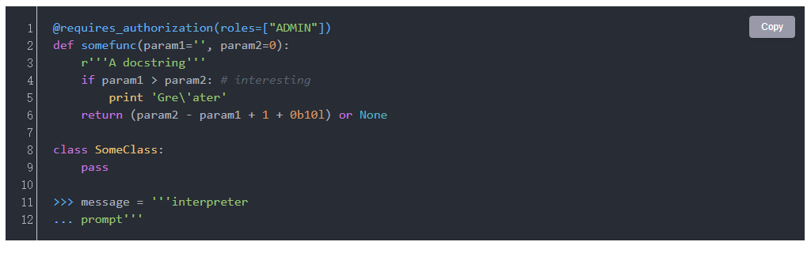

<h1 align="center">joplin-plugin-code-perfect</h1>

优化你的代码块样式

---

[English DOC](./README_EN.md)

## 预览

## 支持功能

1. 优化代码块样式，支持修改代码块主题；
2. 支持显示代码行号；
3. 可显示一键复制按钮，复制代码块内容。

[修改日志...](./CHANGE_LOG.md)
