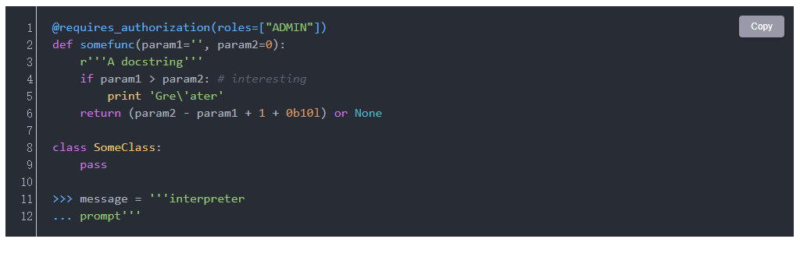

<h1 align="center">joplin-plugin-code-perfect</h1>

Make your code blocks look perfect!

---

## Preview

## Supports

1. Optimize code block styles and support modifying code block themes;
2. Support displaying code line numbers;
3. It can display a one click copy button to copy the content of code blocks.

[Change log...](./CHANGE_LOG_EN.md)
